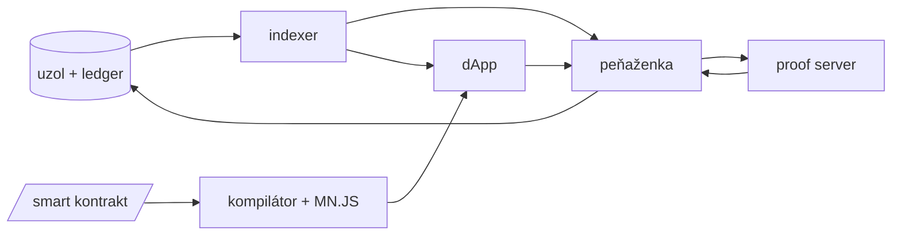

*Cieľom tohto článku je zosumarizovať skúsenosti a výzvy, s ktorými som sa stretla v rámci testovania na blockchainovom projekte*

### Úvod do blockchainu (Midnight)

Koncom roka 2021 som začala pracovať pre inžiniersku spoločnosť za kryptomenou Cardano. V tom čase som nemala žiadnu prax s testovaním blockchainu, ale Bitcoin a kryptomeny ma zaujímali. Dostala som sa na projekt úplne nového blockchainu Midnight s podporou dôverných transakcií a smart kontraktov.
Niektoré vlastnosti a mechanizmy fungovania majú blockchainy spoločné, iné sú jedinečné. Midnight napr. kombinuje tzv. UTXO model (pre transakcie peňaženka-peňaženka) a account model (pre smart kontrakty). Dosť veľa vecí na podporu testovania sme museli riešiť vo vlastnej réžii.

Začnem popisom jednotlivých komponentov projektu. Ten prešiel niekoľkými iteráciami, keď som prišla, bol uzol napísaný v Scale, smart kontrakty inšpirované Ethereom a používalo sa na ne Remix IDE, peňaženka bola desktopová aplikácia. Výskum pokračoval a postupne sa menili technológie, architektúra a koncept fungovania smart kontraktov, na záver bol stav zhruba takýto:

- knižnica ledgeru (účtovnej knihy): jadro blockchainu, mechanizmus spracovania transakcií, stavu mincí (minutých a neminutých) a smart kontraktov
- blockchainový uzol: v Ruste, založený na modulárnom [Substrate SDK od Polkadot](https://docs.polkadot.com/develop/parachains/intro-polkadot-sdk/#substrate), bežiace uzly vytvárajú samotnú blockchainovú sieť, prijaté transakcie spracúvajú, validujú a pridávajú do nových blokov podľa pravidiel ledgera
- indexer: v Ruste, spracúva transakcie uzla, na ktorý je napojený, poskytuje GraphQL API pre ľahšie dotazovanie sa na dáta blockchainu a beží procesy read-only peňaženiek (ktoré potom môžu fungovať ako tzv. light peňaženky aj v prehliadači)
- knižnica peňaženky a implementácia peňaženky ako rozšírenia do prehliadača: v [Scala.js](https://www.scala-js.org/) a TypeScripte, peňaženka umožňuje vytvárať transakcie (medzi adresami jednotlivých peňaženiek alebo na/z adresy smart kontraktov pri interakcii s nimi)
- proof server: v Ruste, beží na lokálnom zariadení používateľa, jeho úlohou je vytvoriť tzv. zero-knowledge dôkaz o súkromných prvkoch transakcie, ktorý je potom overiteľný
- programovací jazyk Compact: vlastný jazyk pre smart kontrakty, vyžadoval si svoj kompilátor
- knižnica pre použitie v TypeScripte (Midnight.js): na vývoj decentralizovaných aplikácií nad Midnightom - prepája smart kontrakty v Compacte s TypeScriptom, obsahuje klientov pre peňaženku, indexer, proof server a iné
- kryptografické knižnice: použité v ledgeri a iných komponentoch, mimo záber testerského tímu

Zjednodušený diagram:

Zjednodušený popis transakcie:
1. peňaženka sa musí zosynchronizovať s blockchainom, aby mala aktuálne dáta o svojich minciach
1. pripraví transakciu
1. pošle ju proof serveru
1. od neho dostane proof, ktorý zapracuje do konečnej podoby transakcie a pošle uzlu
1. ak prejde cez všetky kontroly ledgera a je zahrnutá do bloku
1. indexer spracuje nový blok
1. indexer pošle peňaženke aktualizáciu, ktorú ona aplikuje na svoj stav a zmena zostatku sa prejaví v peňaženke

Ako vidíte, ide o pomerne zložitý a prepojený systém plný závislostí. Naviac si bolo treba uvedomiť, že persónami nášho produktu boli aj prevádzkovatelia blockchainovej infraštruktúry a vývojári decentralizovaných aplikácií.

### Testovanie peňaženky

Najviac času som strávila v tíme peňaženky. Automatizované testy som vytvorila pre rozšírenie do prehliadača (s pomocou [Playwrightu](https://playwright.dev/)) aj pre knižnicu (s testovacím frameworkom [Jest](https://jestjs.io/)).
Keďže inštancia peňaženky potrebuje pre chod proof server, uzol a indexer, tieto som lokálne spúšťala pomocou docker-compose súborov a pri automatizovaných testoch som využívala [Testcontainers](https://testcontainers.com/) a možnosť ovládať kontajnery z testu - napr. dočasné stopnutie niektorého z kontajnerov.

Čo sa týka rozšírenia, Playwright vyžadoval beh v headed móde (neskôr som zachytila, že experimentálne sa to dá už aj v headless), perzistentný context a práca s oknom rozšírenia (otvorenom po kliknutí na ikonu v toolbare) sa simulovala prístupom na `chrome-extension://${extensionId}/popup.html` a nastavením veľkosti viewportu.
Pri testovaní som použila aj rozšírenia na inšpekciu localStorage, či sa dáta a nastavenia peňaženky správne ukladajú a aktualizujú po zmene.
Normálny používateľský flow si vyžadoval na začiatku používania rozšírenia prejsť tzv. onboardingom (vytvorením novej peňaženky - páru kľúčov reprezentovaných 24slovnou frázou, nastavením hesla a endpointov, ktoré má peňaženka použiť), v automatizovaných testoch sa to dalo obísť vložením dát do localStorage.
Pri používaní peňaženky s dlhodobo bežiacimi sieťami (blockchainovou sieťou na staging prostredí) a pre scenáre s čiastočnou synchronizáciou (od posledného pripojenia k indexeru) som využila uloženie User Data Directory (obsahuje localStorage) do artefaktu GitHub Actions, pričom nasledujúci beh nightly testov si ho stiahol a rozšírenie nainštaloval s existujúcou peňaženkou a blockchainovými dátami. Plná synchronizácia od začiatku - bloku 0 pri sieti dosahujúcej milión blokov trvala aj vyše hodinu.
Dôležitá bola aj výkonnosť, objavili sa bugy, keď dlho bežiace rozšírenie nakoniec spadlo a ráno po otvorení notebooku ste našli spadnutý tab. Na limit som narazila aj v prípade peňaženky, ktorá spravila v histórii veľa transakcií a jej dáta v úložisku narástli cez 50 MB, čo fakticky znemožnilo ďalšiu prácu s rozšírením.

Čo sa týka samotnej peňaženky ako knižnice a problémov, čo mi utkveli v pamäti - mala som testovacie peňaženky, ktoré si medzi sebou posielali malú sumu. Ak sa nahromadilo na jednej veľa mincí a chcela som ich veľa použiť v transakcii (napr. suma 20 DUST z 20x1 DUST), proof server zlyhal, keďže musel vytvoriť dôkaz pre každú jednu použitú mincu a ani navyšovanie timeoutu a pamäte pre proof server kontajner nepomáhalo. Ďalší zaujímavý prípad bol, keď transakcia pozostávala z takých mincí, že presne pokryli prevádzanú sumu aj poplatky za transakciu a peňaženke sa nemal vrátiť žiaden výdavok. Vtedy takpovediac ostala čakať za aktualizáciou od indexera a peňaženka ostala nepoužiteľná. Ako rýchlejší fix sa to riešilo povinným výdavkom v každom prípade, aj keď sa kvôli tomu musela pridať ďalšia minca do transakcie.
Mimochodom, algoritmus výberu mincí do transakcie a výpočtu poplatkov som raz dostala od môjho developera popísaný na celej strane PDF.

### Testovanie uzla

Tu som strávila posledné mesiace práce. Tento komponent mal závislosti na uzle a ďalšej infraštruktúre z Cardano strany (Midnight je vlastne sidechain alebo partner chain Cardana). Aby sme vedeli testovať a bežať Midnight blockchain aj bez nich, dal sa zapnúť mock follower mód. Samotný Midnight uzol mohol bežať v rôznych konfiguráciách.

Nie úplne triviálnym sa ukázalo "klonovanie" blockchainu, nakoniec vývojár prišiel na to, že sa dá oddeliť uzol z existujúcej siete a potom v oddelenom prostredí k nemu pripojiť nové uzly.

Stretla som sa s [blockchain explorerom od Polkadot](https://polkadot.js.org/apps/#/explorer).

### Testovanie v súvislosti s ďalšími komponentmi

#### Indexer

V tíme indexera som na chvíľu zaskakovala za kolegu. Komponent bol prepísaný zo Scaly do Rustu a vylepšený a našla som si [nástroj na identifikáciu zmien v GraphQL API](https://the-guild.dev/graphql/inspector).
Komponent mával problémy s výkonnosťou, dlhý blockchain a peňaženky s veľkou transakčnou históriou mu dávali zabrať.

#### Kompilátor

Pri príležitosti porovnávania výkonnosti komponentov pri zmene podkladovej kryptografie som našla chybu pri pokuse skompilovať istý smart kontrakt s niekoľkými úrovňami vnorenia.

#### Hard Fork

Samostatnou kapitolou boli orchestrácia a testovanie tzv. hard forku - upgradu blockchainu naprieč všetkými hlavnými komponentmi.

#### Dokumentácia, open sourcing

(https://docs.midnight.network/)

### Netradičné prístupy k testovaniu

Netradičná situácia a projekt si vyžiadali aj netradičné prístupy v testovaní, o ktorých som písala [v tomto článku](/posts/netradicne-testovanie).

### Záver

Testovanie blockchainu   a išlo jednoznačne o najkomplexnejší a najnáročnejší projekt, na ktorom som dosiaľ mala možnosť pracovať.
